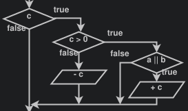
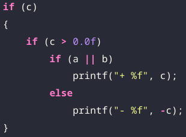
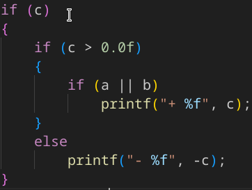
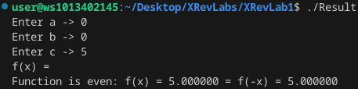
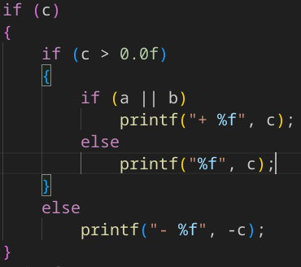
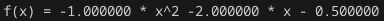
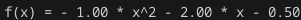

# Lab work 1

# Отчёт
### Задание
1. Составить блок-схему алгоритма для своего варианта. (8 вариант)
2. Написать программу решающую задачу.
3. Проанализировать программу из примера. Внести в неё изменения, исправления или оптимизацию.

### описание проделанной работы
1. Составил блок-схему алгоритма, пользуясь *programforyou.ru*.
2. Написал программу решающую задачу, пользуясь языком программирования `C`.
3. Проанализировал программу из примера.
4. Внёс изменения в программу из примера.

---
# Блок-схема
.png)

---
# Программа ***ProgrammName.c***
### Инструкция по запуску
1. Открыть программу в VSCodium
2. Открыть консоль
3. Прописать в консоли две команды
   1.   `gcc ProgrammName.c -o Result`
   2.   `./Result`

---
# Анализ и редакция кода из примера
1. выводить 6 знаков после точки слишком громоздко и не очень нужно, поэтому будем выводить лишь 2 знака после точки, пользуясь `%.2f` вместо `%f`
---
2. В часте кода с выводом переменной `c` сделанна с ошибка, исправляем ошибку согласно блок-схеме. \

---
3. В случае, когда `a`=0 и `b`=0, согласно блок-схеме, переменная `с` не выводится, хотя программа идёт дальше и при этом выводится, что функции несуществует (Хотя по определению её и правда не существует) в случае, если функции не существует, программа должна завершиться, в случае, если считать f(x)=c - функцией, программа должна выводить `c`. Я решил применить второй вариант и вывести `c`. \

---
4. Я решил отредактировать вывод чтобы он выглядел более форматировано, а в частности пробел после знака перименной \
 \
Исправленная версия: \

\
---
Отредактированная версия находится в файле `Example.c`\